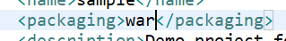

# 서비스 배포하기


aws를 올리기위해 원격PC Ubuntu를 설정하는 것이라고 생각할 수 있음 

- Ubuntu가 가볍고 가장 빠름 
- 
- 우분투 선택
- 
- pem 파일 만들기
- 오잉.. 어제까지는 괜찮았는데 갑자기 계정이 block 되어 버렸다.
- This account is currently blocked and not recognized as a valid account. Please contact aws-verification@amazon.com if you have questions.
- 문의 메일을 보내바야겠다.

## (1) jar 파일로 배포하기

- #### Run as Maven build


build success 후!!


target 파일에 들어가서 확인하기 jar


제대로 생성된 것을 알 수 있음 

이파일 경로를 cmd에 경로를 설정해준 후


내부 배포 실행 완료!!!


이 jar 파일을 아마존 서비스에 올린다고 생각하면 된다.


## 2. git hub에 올려보기


## 3. AWS

### (1) aws 계정 만드릭

### (2) 인스턴스 누르기


#### (1) ubunto Server 선택


#### (2) 프리티어 부분을 선택

##### 1) 시작하기 


##### 2) 접근하기 위한 key 설정 필요


- 외부로 노출되면 안됨 (파일을 주면 안됨)
- 기존 키 페어선택 -> 새 키 페어 선택
- 키 페어 이름 설정 (원하는 이름 아무거나)
- 키 페어 다운로드 (누구에게도 공유하면 안됨)
- 인스턴스 시작!!!


메모 

- 탄력적 IP 만들지말기
- 

#### (3) putty

putty를 설치한 후 

##### 1) puttygen

- key, ppk 설정

- putty configuration 을 통해 배포

  - ip4 옮겨서 하고

  - ppk 를 auth에 입력 한 후 

  - login as -> ubunto 

    

끝!! 


### 2. git hub 통해 오려보기!!


- 인스턴스 실행 후 git clone
- sudo apr-get update 를 하면 
-  sudo apt install openjdk-8-jdk 명령어를 친후 continue -> y 입력
- 

- sudo chmod 777 ./mvnw (권한 설정) --> mvnw 색깔 바껴야함
- ./mvnw clean package (~~~ 다운로드 시작 --> 만약 안된다면, sudo apt install openjdk-8-jdk 실행해준후 다시)
- 


- Build Success!! 행복하당...
- ls를 보면 target 이 생김
- 

- git 에서 클론해와서 빌드한 것 
- cd target에서 명령어 시작(target 에서 ls 를 확인해보면  sample-0.0.1-SNAPSHOT.jar 파일이 핑크로 보임)
- java$ java -jar  sample-0.0.1-SNAPSHOT.jar (명령)
- 

배포 끝!!!!

- 아마존 서버에서 port 3000을 풀어줘야함
- 보안 접속
- 

- 보안그룹으로 들어가면!
- 포트문이 잠겨있어서 문을 열어줘야함 (외북에서 들어갈 수 있도록)
- 인바인드 규칙 편집을 들어가서 port 편집
- 

- 다시 E2C로 들어가서 상태검사에 2/2 검사 통과확인한후 port로 들어가봄
- 

# 배 포 완 성 !!


이제는 war 파일로 배포해보자 (처음엔 jar 파일로 배포함)

## (2) WAR 파일로 배포하기

### 1. war 파일로 만들기!

- pom.xml에 
  - 

추가

- maven build로 succes 확인하기!
- 

- sample 파일에 war 파일이 제대로 만들어졌는지 확인
- 이렇게 하면 에러가 발생한다..
- 새로운 프로젝트 생성
- 

- war로 내보낸 후 tomcat9의 webapp에 war 파일을 넣은 후 bin에서 start.bat 실행!
-  file ziller 설치!!
- 

공인인증키 추가 - > pem 파일 추가 후 열기

사이트 관리자 들어간 후 


짠! 디렉토리 목록 조회 성공.. 어려워!!!


- 외부 톰캣 필요
-  웹 서버를 다운로드 받아야함
  -  (명령어) https://tomcat.apache.org (9버전) 다운받기
  - 


- 링크 주소 복사
  - (명령어) wget https://dlcdn.apache.org/tomcat/tomcat-9/v9.0.52/bin/apache-tomcat-9.0.52.tar.gz
  - 

- tar -zvxf apache-tomcat-9.0.52.tar.gz
  - 파란색 글씨 새로 생김(압축이 풀림)
  - 


- 경로 이동
- 
- 실행되는 파일 중에 startup.sh 를 볼 수 있음

- 실행시키는 방법을 파일 명만 적어주면 됨
  - ./startup.sh
  - 
  - usdo apt install nes-tools
  - netstat -npl

- 종료하는 법
  - ./shutdown.sh

#### Ubuntu에서 명령

- 다시 cd ahache-tomcat-9.0.526 
- cd bin
- JAVA 가 깔려있어야함
- 기본 경로로 가서 다운로드 받는 것이 좋음
- (명령) sudo apt -get update
- (명령) sudo apt install openjdk-8-jdk
- 다시 cd ahache-tomcat-9.0.526 
- cd bin
- ./startup.sh
- 일단 tomcat이 시작됨
- sudo apt install net-tools
- netstat -nlp
- cd ahache-tomcat-9.0.52 로 가서 
- cd conf


- vi 를 키면 에디터가 켜짐
- 

### VI (Visual editor)


- port 넘버를 바꾸고 싶으면
- vi는 insert(키보드)키를 클릭해서 
-   고쳐준다
- esc키 누르면 insert 알림 없어짐
- : w (write)
- :w 파일명(다른이름으로 저장) 
- :w! 쓰기 권한이 없어도 강제저장(권장 안함)
- q 저장 안하고 종료
- :wq 저장하고 나서 종료
- :q! 강제종료(권장 안함)


- 
- 따라서 포트 넘버를 고쳐준 후 저장
- 


#### 2. war 파일 업로드

- war 파일은 webapp 에 넣어줘야함

### 

### Mysql 연동


 my sql 깔기

- sudo apt update 
- sudo apt nstall mysql-server
- sudo mysql -u root -p
- enterpassword 나오면 enter 치면 됨 
- password 걸려있지 않기 때문에


- use mysql;
- --> Database changed
- CREATE USER 'test' @'%' IDENTIFIED BY 'testtest';
- GRANT ALL PRIVIEGES  ON *.* TO 'test'@'%';
- FLUSH PRIVIEGES;
- exis


- cd /etc/mysql
- cd mysql.conf.d
- sudo vi mysqld.cnf 
- sql 에디터 안으로 들어옴
-   INSERT 키를 누륺후 
- bind-address 를 0.0.0.0 으로 바꿔준다 그러면 외부 접속이 가능함
- :wq 해서 나옴
- cd ~
- sudo service mysql restart
- sudo service mysql stop
- sudo service mysql start


### 보안 수정

#### 인바인드 규칙 편집

- mysql 선택해주고 규칙 저장 (portnumber)
- mysql을 연동하기 위한 jar 파일이 필요함

- Mysql community doswnloads를 들어가서 platform independent 를 선택하면
- 다운롣 ㅡ파일이 뜸(Zip 파일로)
- -두번째 것
- 


- mysql-connector-java.jar을 꺼내서 가져옴
- sql 디벨로퍼에가서 환경설정 - 데이터베이스 - 타사 JDBC 드라이버 - 항목 추가 -mysql-connector-java.jar 선택 - 


## (3) 이클립스 연동

 

#### (1) Database open 

- 데이터 베이스 커넥션이 나옴
-  my sql 선택
- 


- new driver 선택해서 add jar 해서
- 연결했던 mysql-connector-java-8.0.26.jar 선택
- 
- 빨간부분 카피해서 URL에 
- 


- 넣어줌 username, password 아까 만든 것을 넣어줌

- 

- jar 파일 추가

- pom.xml에 추가 할 부분

- ```xml
  <dependency>
  		    <groupId>org.springframework.boot</groupId>
  		    <artifactId>spring-boot-starter-jdbc</artifactId>
  		</dependency>
  		
  		<dependency>
  		    <groupId>org.mybatis.spring.boot</groupId>
  		    <artifactId>mybatis-spring-boot-starter</artifactId>
  		    <version>2.1.3</version>
  		</dependency>
  		
  		<dependency>
  		    <groupId>org.mybatis</groupId>
  		    <artifactId>mybatis-spring</artifactId>
  		    <version>2.0.5</version>
  		</dependency>
  		
  		<dependency>
  		    <groupId>org.mybatis</groupId>
  		    <artifactId>mybatis</artifactId>
  		    <version>3.5.6</version>
  		</dependency>		
  		
  		<!-- mysql -->
  		<dependency>
  			<groupId>mysql</groupId>
  			<artifactId>mysql-connector-java</artifactId>
  		</dependency>
  
  ```

- appication.properties 설정

- ```properties
  server.port=3000
  
  spring.datasource.hikari.driver-class-name=com.mysql.cj.jdbc.Driver
  spring.datasource.hikari.jdbc-url=아까 db만들때 넣었던 url
  <!-- jdbc:mysql://ipv도메인/username-->
  
  spring.datasource.hikari.username=//username
  
  spring.datasource.hikari.password=//password
  
  
  ```

- class 생성

- DatabaseConfig.java (class 생성)

- ```java
  package multi.com.f;
  
  import org.springframework.context.annotation.Configuration;
  
  @Configuration
  @PropertySource("classpath:/application.properties")
  
  public class DatabaseConfig{
      
      @Bean
      @ConfigurationProperties(prefix = "spring.datasource.hikari")
      public HikariConfig hikariConfig(){
          return new HikariConfig();
          
      }
      @Bean
      public DataSource dataSource(){
          DataSource dataSource = new HikariDataSource(hikariConfig());
          System.out.pringln("dataSource:"+dataSource);
          return dataSource;
          
      }
      
      public SqlSessionFactory sqlSessionFactory(DataSource datasource) throws Exception{
          System.out.pringln("databaseConfig:sqlSessionFactory");
          //db 연결확인
          
          SqlSessionFactoryBean sqlSessionFactoryBean = new SqlSessionFactoryBean();
          sqlSessionFactoryBean.setDataSource(dataSource);
          
          //org.springframework.core.io.Resource
          Resouce[] arrResource = new 
              //기본 경로로 xml 파일을 인식하겠다
          PathMachingResourcePatternResolver().getResources("calsspath:sqls/*.xml");
          sqlSessionFactoryBean.setMapperLocations(arrResource);
          
          sqlSessionFactoryBean.getPbject().getConfiguration().setMapUnderscoreToCamelCase(true);
          return sqlSessionFactoryBean.getObject();
          
          
      }
      public sqlSessionTemplate sqlSession(SqlSessionFactory sqlSessionFactory){
          return new SqlSessionTemplate(sqlSessionFactory);
      }
  }
  ```

- sqls package 생성 -> xml 파일 생성

- ```xml
  <?xml version="1.0" encoding="UTF-8"?>
  
  <!DOCTYPE mapper
  PUBLIC "-//mybatis.org//DTD Mapper 3.0//EN"
  "http://mybatis.org/dtd/mybatis-3-mapper.dtd">
  
  <mapper namespace="multi.com.f.dao.MemberDao">
  
      <select id="allmember" resultType="multi.com.f.dto.MemberDto">
      	SELECT ID, PWD, NAME, EMAIL, AUTH FROM Member
      </select>
  </mapper>
  ```

- MemberDAO (interface 생성)

- ```java
  package multi.com.f.dao;
  
  
  @Mapper
  @Repository
  public interface MemberDao{
      public List<MemberDto> allmember();
    	//xml에 있는 함수와 이름이 꼭 같아야함
  }
  ```

- MemberService 생성

- ```java
  package multi.com.f.service;
  
  @Service
  @Transactional
  public class MemberService{
      @Autowired
      MemberDao dao;
      
      public List<MemberDto> allmember(){
          //이름이 꼭 같을 필요는 없음
          return dao.allmember();
      }
  }
  ```

- MemberController 생성

- ```java
  package multi.com.f.controller;
  
  @RestController
  public class MemberController{
      @Autowired
      MemberService service;
      
      @RequestMapping(value="/allMember")//그냥 이름좀 다르게 의미는 없음
      public List<MemberDto> allMem(){
          System.out.println("MemberController allMem()" + new Date());
          //호출 확인
          return service.allmember();
      }
      
  }
  ```

- 

