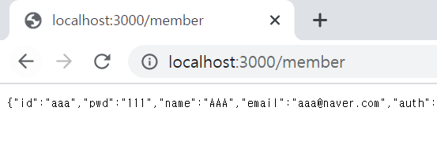

# 서비스 배포하기

## 1. 내부 배포

### (1) jar 파일로 배포하기

- #### Run as Maven build

build success 후!!

target 파일에 들어가서 확인하기 jar

제대로 생성된 것을 알 수 있음 

이파일 경로를 cmd에 경로를 설정해준 후

내부 배포 실행 완료!!!

이 jar 파일을 아마존 서비스에 올린다고 생각하면 된다.

## 2. git hub에 올려보기

## 3. AWS

### (1) aws 계정 만드릭

### (2) 인스턴스 누르기

#### (1) ubunto Server 선택

#### (2) 프리티어 부분을 선택

##### 1) 시작하기 

##### 2) 접근하기 위한 key 설정 필요

- 외부로 노출되면 안됨 (파일을 주면 안됨)
- 기존 키 페어선택 -> 새 키 페어 선택
- 키 페어 이름 설정 (원하는 이름 아무거나)
- 키 페어 다운로드 (누구에게도 공유하면 안됨)
- 인스턴스 시작!!!

